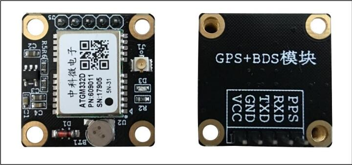
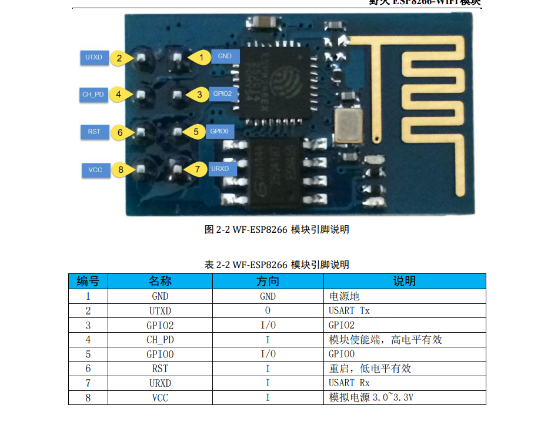
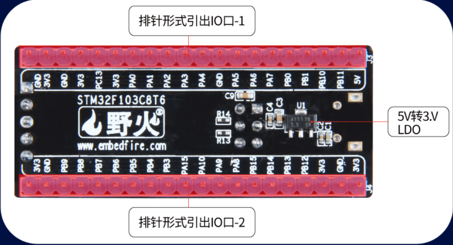
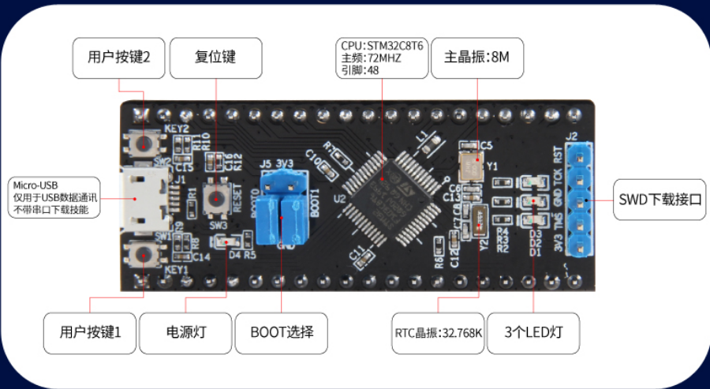
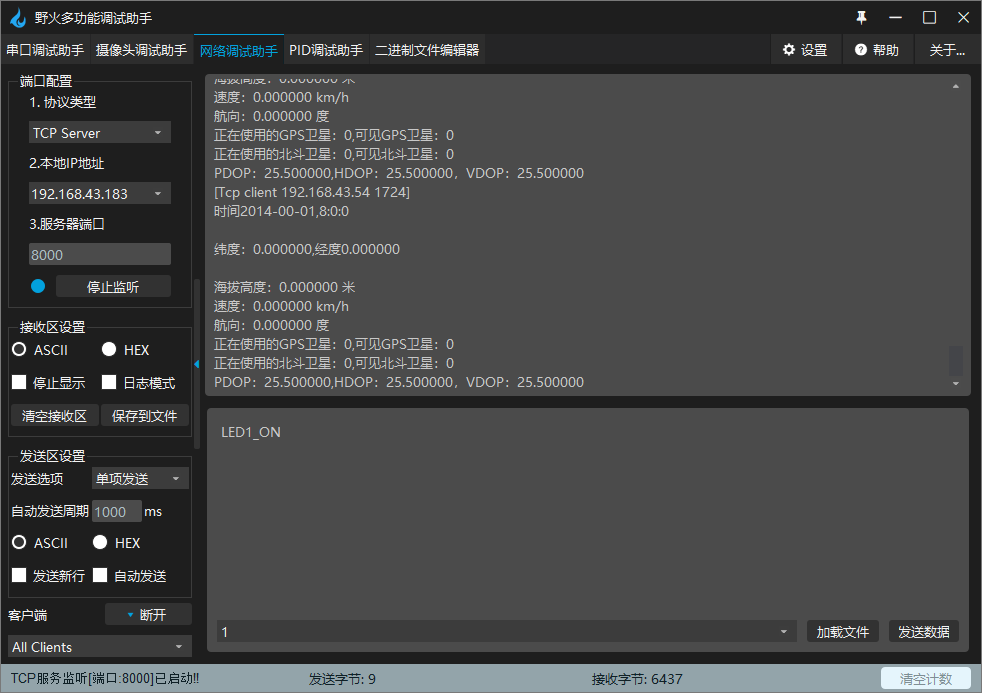

# wifi-gps
现已将项目移植到f429中，使用stm32cubeide进行开发
## 计划
- [ ] 完善程序，删除不必要的代码
- [ ] 扩展MPU6050功能，支持加速度计、陀螺仪、磁力计
- [ ] 绘制原理图和PCB
	
## 方案
STM32F103C8T6核心板通过USART3读取GPS信号，并将信号转换为GPS数据。  
再通过USART2控制ESP8266，与PC端的TCP服务器建立连接，并将GPS数据发送给PC端。  
硬件采用野火的元件，软件移植对应的例程，此仓库用于记录和总结。  

### 北斗
BH-ATGM332D 是野火设计的高性能、低功耗 GPS、北斗双模定位模块。它采用中科微电子公司的 ATGM332D-5N-31 模组方案，可以通过串口向单片机系统和电脑输出 GPS及北斗定位信息，使用简单方便。  

### ESP8266模块
ESP8266 拥有高性能无线 SOC，给移动平台设计师带来福音，它以最低成本提供最大实用性，为 WiFi 功能嵌入其他系统提供无限可能。ESP8266 是一个完整且自成体系的 WiFi 网络解决方案，能够独立运行，也可以作为 slave 搭载于其他 Host 运行。ESP8266在搭载应用并作为设备中唯一的应用处理器时，能够直接从外接闪存中启动。内置的高速缓冲存储器有利于提高系统性能，并减少内存需求。SP8266 高度片内集成，包括天线开关 balun、电源管理转换器，因此仅需极少的外部电路，且包括前端模块在内的整个解决方案在设计时将所占 PCB 空间降到最低。 
  

### STM32F103C8T6
  
  

## 引脚连接和配置
### 北斗(gps_config.h)
>GPS-RXD <--> USART3_TX (PB10)  
>GPS-TXD <--> USART3_RX (PB11)  
>VCC     <--> 3v3  
>GND     <--> GND  

### ESP8266(bsp_esp8266.h)

>UTXD  <--> USART2_RX (PA3)  
>URXD  <--> USART2_TX (PA2)  
>CH_PD <--> PB8  
>RST   <--> PB9  
>VCC   <--> 3v3  
>GND   <--> GND  

### USB转TTL串口(bsp_uart1.h)
>3v3 <--> 3v3  
>GND <--> GND  
>RXD <--> USART1_TX (PA9)  
>TXD <--> USART1_RX (PA10)  

### WiFi名称密码和TCP服务器设置
(bsp_esp8266_test.h)  

## 操作步骤
1.连接引脚，修改wifi和tcp服务器信息后烧录程序。  
2.打开野火多功能调试助手  
3.在调试助手里面：打开串口调试助手、网络调试助手，设置要连接的服务器的 IP 和端口  
4.在网络调试助手接收GPS数据  

运行结果如下：  

